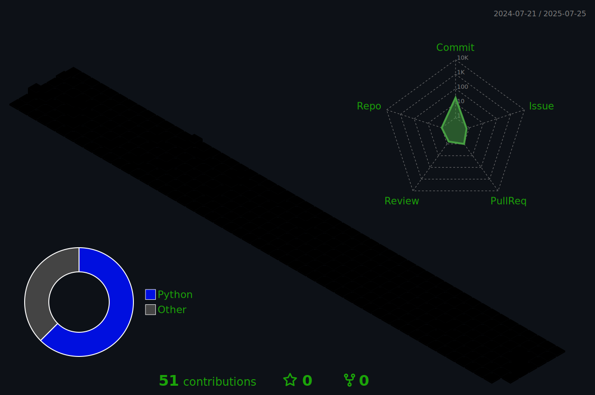

## Howdy 🤙

##

<h3 style="text-decoration:underline;">🧐 Focusing On</h3>

<table align="center" style="margin:0 auto;text-align:left;border-collapse:collapse;">
  <tr><td style="padding:0 .6em;">•</td><td>Security Architecture</td></tr>
  <tr><td style="padding:0 .6em;">•</td><td>AI &amp; Machine Learning</td></tr>
  <tr><td style="padding:0 .6em;">•</td><td>Drone Capabilities (Part 107)</td></tr>
</table>

<h3 style="text-decoration:underline;">📖 Currently Studying AWS Cloud Certs</h3>

<table align="center" style="margin:0 auto;text-align:left;border-collapse:collapse;">
  <tr><td style="padding:0 .6em;">•</td><td>Solutions Architect</td></tr>
  <tr><td style="padding:0 .6em;">•</td><td>Security Specialty</td></tr>
  <tr><td style="padding:0 .6em;">•</td><td>AI Practitioner</td></tr>
  <tr><td style="padding:0 .6em;">•</td><td>Machine Learning</td></tr>
</table>

##

### 

##

 

### 🧰 Check Out Some Of My Projects:

<table style="border-collapse:separate;border-spacing:18px;">
  <tr>
    <td align="center" style="border:2px solid #444;border-radius:10px;padding:14px;">
      
    </td>
    <td align="center" style="border:2px solid #444;border-radius:10px;padding:14px;">
      
    </td>
  </tr>
</table>

 

### 🔗 Link Up With Me @: 

 

 

  <picture>
    <source media="(prefers-color-scheme: dark)"  srcset="https://raw.githubusercontent.com/Dr4gnf1y/Dr4gnf1y/output-3d-contrib/night.svg" />
    <source media="(prefers-color-scheme: light)" srcset="https://raw.githubusercontent.com/Dr4gnf1y/Dr4gnf1y/output-3d-contrib/day.svg" />
    
  </picture>

 

